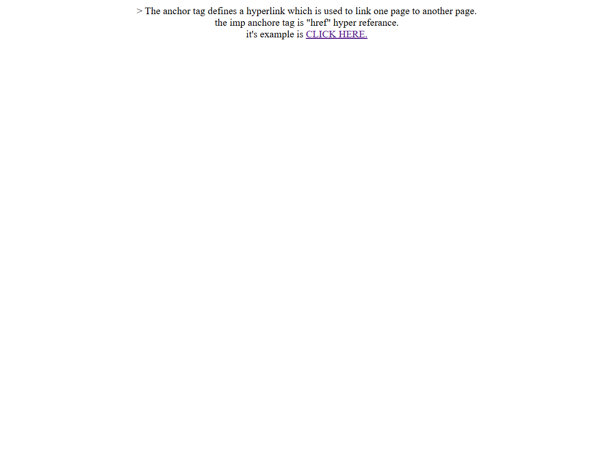
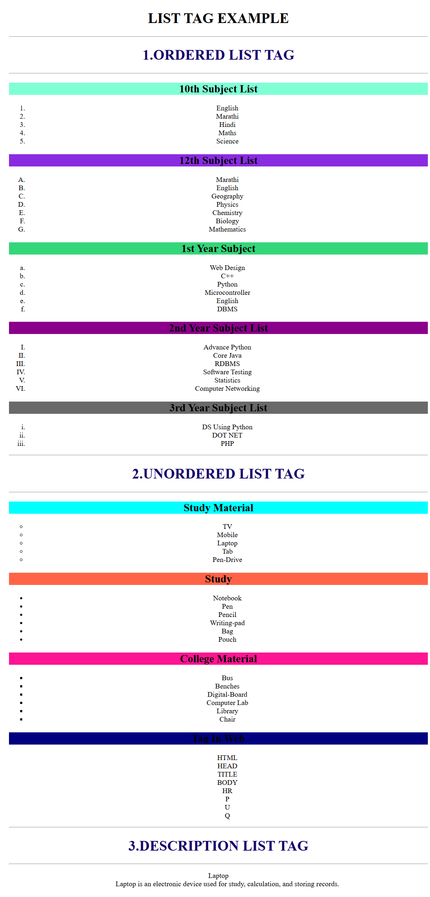
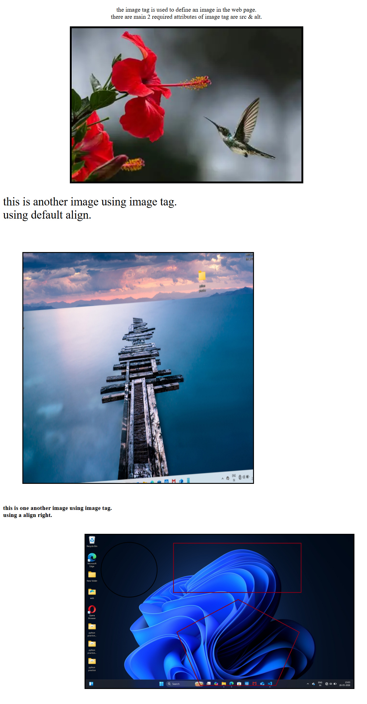
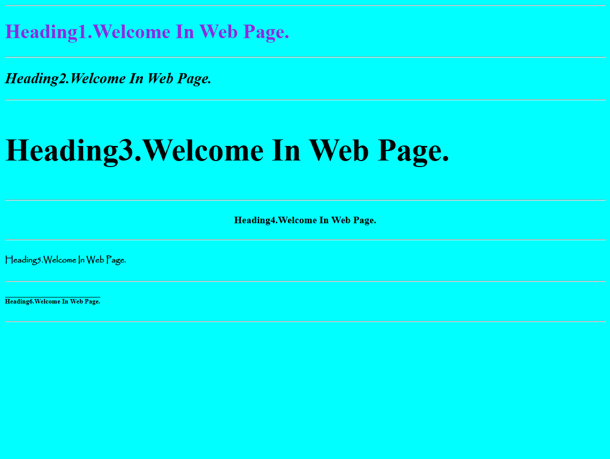
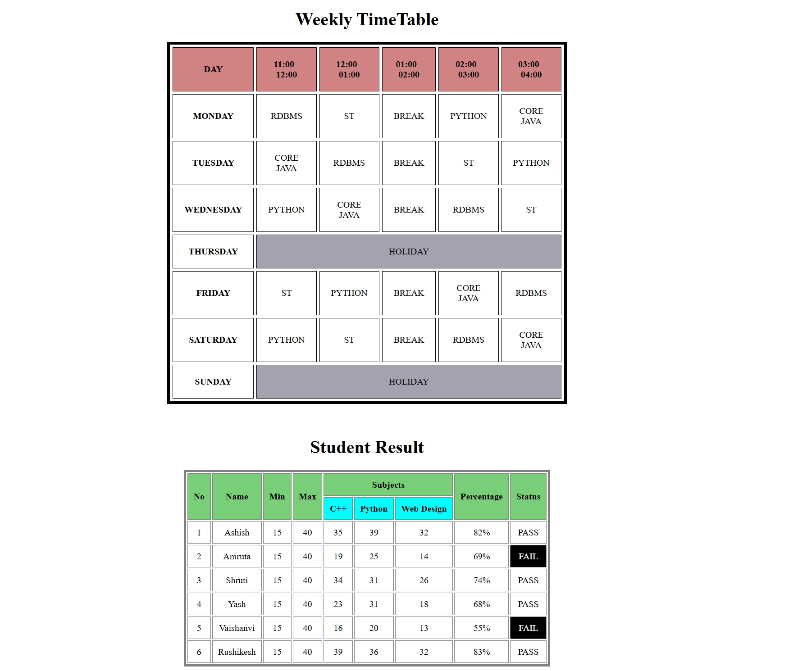
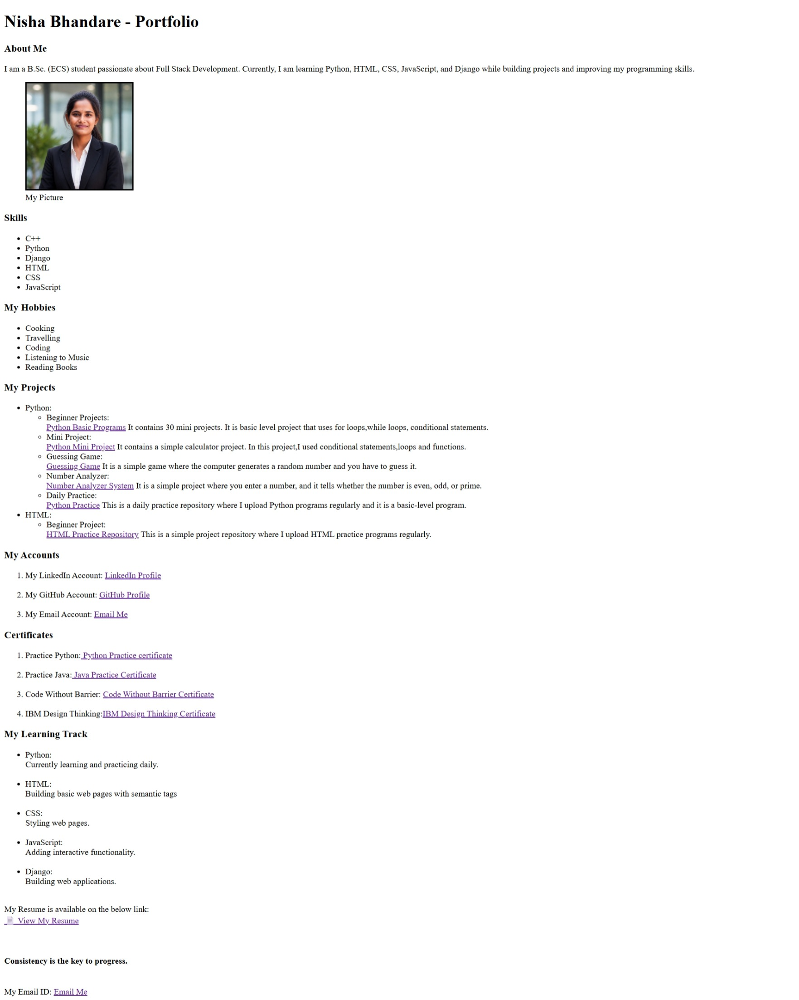
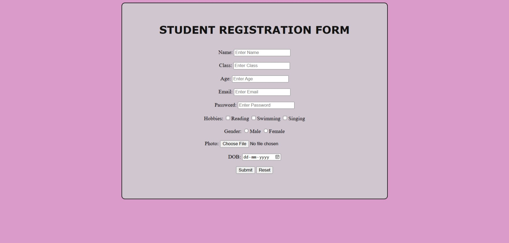
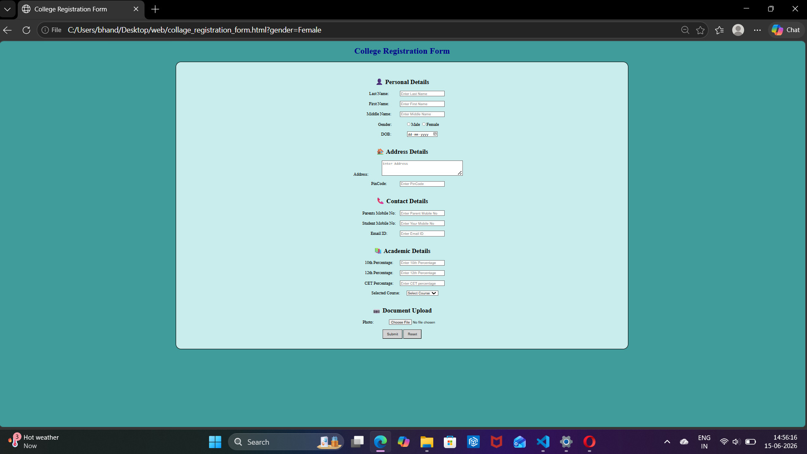
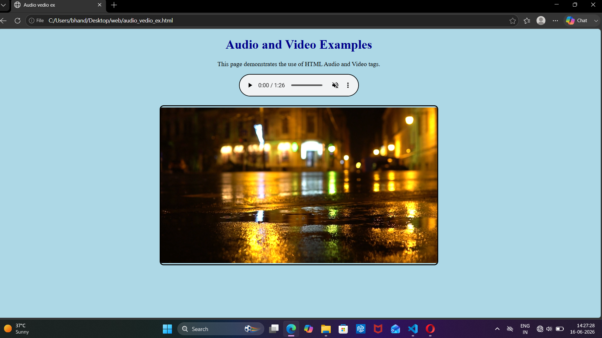

# Anchor Tag Example in HTML

## Description
This program explains the use of the HTML anchor (`<a>`) tag.  
The anchor tag is used to create hyperlinks that connect one webpage to another webpage.

The important attribute of the anchor tag is `href` (Hyper Reference), which specifies the destination link.

---

## Working
- The webpage displays information about the anchor tag.
- A clickable text **CLICK HERE** is provided.
- When the user clicks the link, it opens another webpage named `list_tag_type.html`.

---

## Features
- Demonstrates hyperlink creation in HTML
- Uses the `href` attribute
- Simple beginner-friendly example
- Helps understand webpage navigation

## Tags Used
- HTML
- Head
- Title
- Body
- Anchor (`<a>`) tag
- Line Break (`<br>`)

---

## 📸 Screenshots

### Anchor Tag Output


### List Tag Output


---

## Output
The webpage shows explanatory text along with a clickable hyperlink that redirects the user to another HTML page.

---

## Purpose
This example is useful for beginners to understand:
- What an anchor tag is
- How hyperlinks work
- How webpages are connected in HTML

---

## 👨‍💻 Author
**Nisha Bhandare**


# List Tag Example

This project demonstrates the use of **HTML list tags**:

- **Ordered Lists (`<ol>`)**
- **Unordered Lists (`<ul>`)**
- **Description Lists (`<dl>`)**

## 📸 Screenshot

Here is the output of the program:


## 📑 Features

- **Ordered Lists**
  - Subjects for 10th, 12th, 1st Year, 2nd Year, and 3rd Year.
  - Different numbering styles are used (`1`, `A`, `a`, `I`, `i`).

- **Unordered Lists**
  - Study materials, college materials, and web tags.
  - Different bullet styles are used (`circle`, `disc`, `square`, `none`).

- **Description List**
  - Example with `Laptop` and its description.

## 🛠️ How to Run

1. Clone or download this repository.
2. Open the file `index.html` in any web browser.
3. You will see examples of ordered, unordered, and description lists.

## 📚 Purpose

This code is created for learning and practicing **HTML basics**.  
It helps understand how different list types work and how they can be styled using attributes.

---

## 👨‍💻 Author

- **Nisha Bhandare**  
- Location: Solapur, Maharashtra, India  
- GitHub: [nishabhandare](https://github.com/nishabhandare)

---

✨ Feel free to modify the lists or add more examples to practice!

# Image Tag Example in HTML

## 📖 Description
This project demonstrates the use of the HTML **image (``) tag**.  
The image tag is used to display images on a webpage.  

The two required attributes of the image tag are:
- **src** → specifies the path of the image file  
- **alt** → provides alternative text if the image cannot be displayed  

---

## ⚙️ Working
- The webpage displays explanatory text about the image tag.  
- Multiple images are shown with different alignments and styles:
  - Center aligned image
  - Default aligned image
  - Right aligned image with border and spacing  

---

## ✨ Features
- Demonstrates how to insert images in HTML  
- Shows usage of `src` and `alt` attributes  
- Explains alignment and styling options  
- Beginner-friendly example for practicing HTML basics  

---

## 🏷️ Tags Used
- HTML  
- Head  
- Title  
- Body  
- Paragraph (`<p>`)  
- Bold (`<b>`)  
- Image (``)  

---

## 📸 Screenshot

Here is the output of the program:



---

## 🎯 Purpose
This example is useful for beginners to understand:
- How to display images in a webpage  
- How to use attributes like `src` and `alt`  
- How alignment and styling affect image placement  

---

## 👩‍💻 Author
**Nisha Bhandare**


# Headings Example in HTML

## 📖 Description
This project demonstrates the use of HTML heading tags (`<h1>` to `<h6>`).  
Each heading is styled differently using inline CSS to show variations in color, font, alignment, and decoration.

---

## ⚙️ Working
- The webpage displays six headings (`<h1>` to `<h6>`).  
- Each heading has a unique style applied:
  - Color
  - Font style
  - Font size
  - Text alignment
  - Font family
  - Text decoration  

---

## ✨ Features
- Demonstrates all six heading levels in HTML  
- Shows how inline CSS can style headings  
- Beginner‑friendly example for practicing HTML basics  

---

## 🏷️ Tags Used
- HTML  
- Head  
- Title  
- Body  
- Heading (`<h1>` to `<h6>`)  
- Horizontal Rule (`<hr>`)  

---

## 📸 Screenshot

Here is the output of the program:



---

## 🎯 Purpose
This example is useful for beginners to understand:
- The difference between heading levels  
- How CSS styles can change text appearance  
- How headings structure a webpage  

---

## 👩‍💻 Author
**Nisha Bhandare**


# HTML Practice

This repository contains my HTML practice programs and exercises.

## Topics Covered

- HTML Tables
- Rowspan and Colspan
- Timetable Design
- Student Result Table
- Basic Formatting
- Table Styling using HTML attributes

## Projects

### 1. Weekly Timetable
- Created a weekly class timetable.
- Used `colspan` for holiday rows.
- Practiced table structure and formatting.

### 2. Student Result Table
- Displayed student marks and results.
- Used `rowspan` and `colspan`.
- Added PASS/FAIL status.
- Organized subject-wise marks.

## Technologies Used

- HTML5

## Learning Outcomes

- Improved understanding of HTML tables.
- Learned how to merge rows and columns using `rowspan` and `colspan`.
- Practiced creating structured and readable table layouts.

  ## Output



## Author

Nisha Bhandare


# Personal Portfolio Website

## Overview

This project is a personal portfolio website created using HTML5 semantic tags. The purpose of this project is to showcase my educational background, technical skills, projects, certificates, learning journey, and professional profiles in a structured and organized way.

The portfolio demonstrates the use of semantic HTML elements and basic webpage structuring without using CSS or JavaScript.

---

## Features

* Personal introduction section
* Profile picture with caption
* Technical skills list
* Hobbies section
* Project showcase with GitHub repository links
* Certificates section
* Learning track section
* Resume link
* GitHub and LinkedIn profile links
* Semantic HTML structure

---

## Technologies Used

* HTML5

---

## Semantic Tags Used

This project uses the following semantic HTML tags:

* `<header>`
* `<section>`
* `<figure>`
* `<figcaption>`
* `<nav>`
* `<aside>`
* `<footer>`

---

## Project Sections

### About Me

Provides a brief introduction about my educational background and learning journey.

### Skills

Includes technical skills such as:

* C++
* Python
* Django
* HTML
* CSS
* JavaScript

### Hobbies

Lists personal interests and hobbies.

### Projects

Contains links and descriptions of:

* Python Basic Programs
* Python Mini Project
* Guessing Game
* Number Analyzer System
* Python Practice Repository
* HTML Practice Repository

### Certificates

Includes certificates earned through various learning platforms and practice programs.

### Learning Track

Shows the technologies and topics I am currently learning.

### Resume

Provides access to my latest resume.

---

## Screenshot



---

## Learning Outcome

Through this project, I learned:

* HTML document structure
* Semantic HTML tags
* Lists and nesting
* Images and hyperlinks
* Organizing webpage content
* Creating a personal portfolio webpage

---

## About the Author

I am Nisha Bhandare, a B.Sc. (ECS) student and an aspiring Full Stack Developer. I am currently learning Python, HTML, CSS, JavaScript, and Django while building projects to improve my programming and web development skills.


---

## Author

**Nisha Bhandare**

B.Sc. (ECS) Student

Aspiring Full Stack Developer

GitHub: https://github.com/nishabhandare


# Student Registration Form (HTML Project)

## Project Overview
This is a simple Student Registration Form created using HTML.  
It is a practice project to learn HTML form elements and basic webpage structure.

## Features
- Name, Class, Age, Email, Password fields
- Gender selection using radio buttons
- Hobbies selection using checkboxes
- File upload option for photo
- Date input for DOB
- Submit and Reset buttons
- Simple and clean layout

## Technologies Used
- HTML5

## Project Structure
web_design_practice/
│
├── form_example.html
├── form_example_output.jpeg
└── README.md

## How to Run
1. Download or clone the repository
2. Open form_example.html in any browser
3. Fill the form and test it

## Output Screenshot


## Learning Purpose
This project helps to understand:
- HTML form structure
- Input types in HTML
- Labels and user input handling
- Basic web page design

## Author
Nisha Bhandare

## Future Improvements
- Add CSS styling for better design
- Add form validation
- Make it responsive
- Connect with backend (database)


# College Registration Form

## Description

This project is a simple College Registration Form created using HTML. It collects personal, address, contact, academic, and document details from students.

## Features

* Personal Details Section
* Address Details Section
* Contact Details Section
* Academic Details Section
* Document Upload Section
* Gender Selection using Radio Buttons
* Course Selection using Dropdown Menu
* Required Field Validation
* Submit and Reset Buttons

## Technologies Used

* HTML5

## Project Files

* `college_registration_form.html` - Main HTML file
* `college_registration_form_output.jpeg` - Output Screenshot

## Output Screenshot



## Learning Outcomes

Through this project, I practiced:

* HTML Forms
* Input Elements
* Radio Buttons
* Dropdown Lists
* Textarea
* File Upload
* Form Validation using Required Attribute
* Basic Form Styling with Inline CSS

## Author

Nisha Bhandare

# HTML Audio and Video Example

## Description

This project demonstrates the use of HTML5 Audio and Video tags to embed multimedia content into a web page.

## Features

* Audio player with controls
* Video player with controls
* Autoplay and muted attributes
* Styled interface with background color
* Rounded borders for audio and video elements
* Center-aligned content

## Technologies Used

* HTML5

## Project Structure

```text
Audio-Video-Example/
│
├── audio_vedio_ex.html
├── audio.mp3
├── audio_video_ex_output.png
└── README.md
```

## Output Screenshot



## Learning Outcomes

* Using the `<audio>` tag
* Using the `<video>` tag
* Working with multimedia files
* Understanding attributes such as:

  * controls
  * autoplay
  * muted
* Applying basic inline CSS styling

## Note

The video file is not included in this repository because of its large file size. To test the video player, add your own MP4 file and name it `video.mp4`.


## Author

Nisha Bhandare
B.Sc. (E.C.S.) Student


